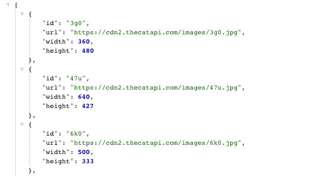
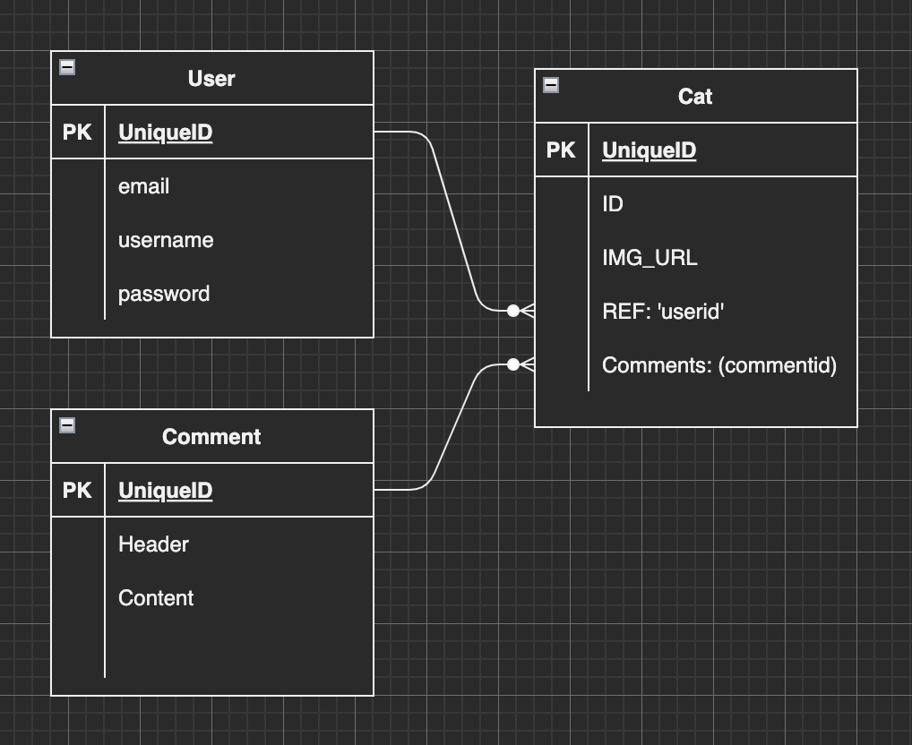
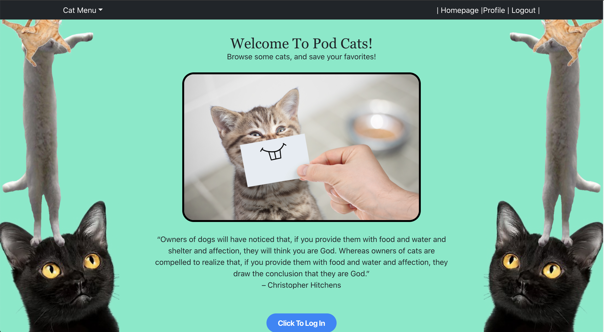
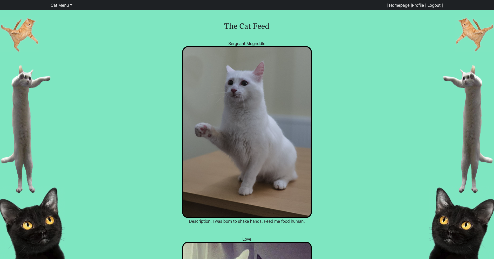
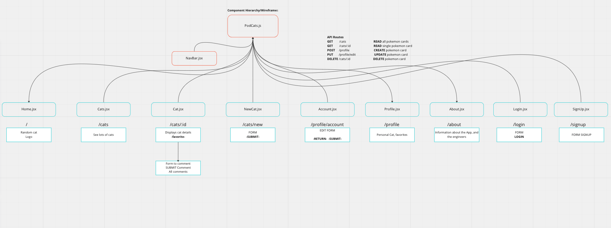

# Pod Cats

## Project Idea and Descriptions

Pod Cats is a social media and educational application designed for your pet cat. This online application will allow cat owners to post and share pictures of their cute and diabolical best friend. Additionally users will be able to view posts from other cat enthusiasts.

## Choice of API and proof of concept

https://api.thecatapi.com/v1/images/search?limit=10

## ERDs

## Application Site

## Restful Routing Chart

#### Users

| Method | URL pattern | Action | Description |
|:------:|:-----------:|:------:|:-----------:|
| GET    | /signup | Read | Render form for creating new User |
| POST   | /signup | Create | Create new user |
| GET    | /login | Read | Render form for users to log in |
| POST   | /login | Read | Verify user login info |
| GET    | /logout | Read | Log out user and user cookie id |
| GET    | /profile | Read | Display user info and user cat posts |
| GET    | /profile/account | Read | Render form for updating user information |
| PUT    | /profile/account | Update | Edit/update user information |
| DELETE | /profile/account | Delete | Delete user from DB |

#### Cat
| Method | URL pattern | Action | Description |
|:------:|:------:|:------:|:-----------:|
| GET    | /cats | READ | Render a feed of all (recent) cat posts |
| GET    | /cats/id/:id | Read | Display specific cat post |
| DELETE    | /cats/id/:id | Delete | Delete a specific cat post |
| GET    | /cats/new | READ | Render form for a new cat post |
| POST   | /cats/new | CREATE | Create a new cat post |

## Techstack
* React (Front-End Framework)
* Axios (NPM Package to retrieve data from API)
* React-Router-Dom (Front-End Framework)
* jwt-decode (Backend token decoder)
* Bcrypt (Backend, password hasher)
* Bootstrap (CSS Package)
* Tailwind (CSS Package)
* CSS 
* Javascript
* MONGODB (Backend Server)
* Dotenv (Backend Environment)
* Cors (Middleware for backend and frontend)
* Node
* Express (Display backend data through simple html)
* Rowdy (Server configuration library)
* Mongoose (Backend Server node module package)

## Wireframes

## Userstories
* As a user I want to be able to create an account
* As a user I want to be able to create a new cat post (image, caption, header)
* As a user I want to be able to comment on other cat owner posts
* As a user I want to be able to remove a cat post from my profile
* As a user I want to learn more about cat breeds
* As a user I want to see a LOT of cat pictures
* As a user I want to be able to edit my existing account details (display name)

## MVP Goals
* Create an account
* Ability to log in and log out
* Ability to post pictures of your cat
* Allow users to comment on cat posts
* Functioning Routes

## Stretch Goals
* Allow users to share posts with other users in a feed ???
* Available Cat adoption?
* Cat articles, facts (third API)
* Allow users to comment on posts
* Edit favicon
* Limited feed of posts, unless users scroll to display additional posts 
